# KnetMiner-LLM

Evidence-grounded biomedical graph retrieval with leakage-safe HGT evaluation, strict citations,
and abstention over Open Targets-derived evidence.

## Status

The source and offline fixture suite are implemented. On 2026-09-06,
`python -m pytest -q` passed 127 tests with four dependency warnings and exit code 0;
`python -m compileall -q src tests` also exited 0. These local checks use synthetic fixtures and
mocked HTTP transports.

A private Kaggle run completed on 2026-09-06. Its sanitized suite record reports 125 passing tests
with exit code 0; the CUDA-only environment skipped the local unavailable-CUDA regression, but the
record did not retain a skip or warning count. The run verified Open Targets release metadata
`26.06`, trained the bounded HGT benchmark on a Tesla P100 for seeds 42/43/44, executed the pinned
Qwen 30/15 gate, and produced a frozen bundle whose artifact hashes and strict loader validation
pass.

### Bounded Kaggle Results

| Metric | Mean | Population standard deviation |
| --- | ---: | ---: |
| AUCPR | 0.3931 | 0.0353 |
| ROC-AUC | 0.2725 | 0.0386 |
| Filtered MRR | 0.0114 | 0.0047 |
| Hits@5 | 0.0133 | 0.0109 |

These are measured results on the approved bounded snapshot, not a public benchmark or evidence of
improvement. Each seed used 350 train, 75 validation, and 75 test disease-target edges. The HGT
artifact SHA-256 is
`69bcd222be13d0eefbce85f1fadcffeb64fa690d1eeceb9bc4b1763cf9740c45`.

The model-backed gate attempted 30 generations, but **0 of 30** passed the exact claim schema and
text validator. All 30 answerable rows therefore used deterministic evidence-backed fallbacks; the
15 unsupported rows abstained. Citation validity and abstention F1 were both 1.0 for those validated
final outputs. These values demonstrate the safety fallback contract, not Qwen answer quality. The
bundle evaluation report hash is
`d58a92c9dd3af2b3a995f9a4cd745dd2df410d9a3754a58c372fb8d1e1aeba24`.

This repository contains no dataset, model weights, trained checkpoint, generated benchmark output,
or hosted application. It makes no clinical, deployment, affiliation, or guaranteed-performance
claim.

## Architecture

```mermaid
flowchart LR
    OT[Open Targets 26.06 records] --> N[Normalize and validate]
    N --> G[NetworkX and PyG graph views]
    G --> S[Leakage-safe disease-target split]
    S --> H[Optional HGT reranking]
    G --> R[Bounded observed-path retrieval]
    H --> R
    R --> T[Typed synthesis input]
    T --> Q[Pinned local Qwen]
    Q --> V[Strict claim and citation validation]
    V --> A[Supported answer or abstention]
    A --> B[Hash-bound frozen bundle]
```



One normalized snapshot owns graph truth. Reverse edges exist only for message transport and cannot
be cited. HGT scores existing candidates; it cannot create edges, paths, citations, or biological
facts. Model output is untrusted and cannot bypass the deterministic validator.

## Install

Python 3.11 is the locally verified interpreter.

```powershell
python -m venv .venv
.\.venv\Scripts\Activate.ps1
python -m pip install --upgrade pip
python -m pip install -e ".[dev]"
```

Install the optional local-model adapter with:

```powershell
python -m pip install -e ".[dev,model]"
```

The standard dependency manifest is `requirements.txt`. Kaggle uses
`requirements-kaggle.txt`, which pins a matching CUDA 12.1 PyTorch, TorchVision, and TorchAudio set
compatible with the Tesla P100 workers observed during validation.

## Test

```powershell
python -m pytest -q
python -m compileall -q src tests
```

The offline suite does not need Open Targets access, model files, credentials, a GPU, or a cloud
account.

## Run The Workload

The command-line entry point has two evidence-producing modes:

```text
knetminer-runtime hgt --help
knetminer-runtime model-bundle --help
```

Both require an explicitly staged normalized snapshot and its SHA-256. The HGT command also requires
a pinned MiniLM directory or `--allow-model-download`; a CUDA request fails instead of silently using
CPU. The model-bundle command requires the exact 30-answerable/15-unanswerable question artifact and
a pinned Qwen directory or the same explicit download gate.

For a clean remote run, attach a private allowlisted source dataset to
`notebooks/kaggle_run_06-knetminer-llm.ipynb` and follow
`notebooks/KAGGLE_RUNBOOK_06-knetminer-llm.md`. The checked-in notebook is unexecuted and all external
gates default to `NOT_APPROVED`; enable them only in a private staging copy.

## Design Contracts

- The only core source is Open Targets Platform 26.06 under CC0.
- Nodes are exactly `disease`, `target`, and `drug`, identified by stable source IDs.
- Citable relations are exactly `disease_target`, `disease_drug`, and `target_drug`.
- Held-out direct disease-target edges and reverse twins are removed from message passing.
- HGT uses seeds 42, 43, and 44 and reports AUCPR, ROC-AUC, filtered MRR, and Hits@5.
- Retrieval is bounded to three edges, 2,000 expansions, two seconds, 100 candidates, and five outputs.
- Entity resolution is exact ID, then exact alias, then threshold-and-margin-gated semantic suggestion.
- Raw input is limited to 300 characters; synthesis receives typed evidence, not user instructions.
- Every answered claim cites an observed bundled path. Unsupported cases abstain.
- Runtime records bind model revision, seeds, device, software versions, inputs, and artifact hashes.

See [Architecture](docs/architecture.md) and [Data and Safety](docs/data-and-safety.md) for details.

## Reproducibility

The intended runtime inputs are a normalized Open Targets 26.06 snapshot, an exact 30/15 evaluation
artifact, pinned model revisions, and explicit device and seed settings. Result writers use canonical
JSON and record SHA-256 identities. A frozen bundle is accepted only when its schema, provenance,
citation validity, abstention gate, and artifact manifest validate.

Do not treat the structural retrieval fixture as an independent scientific benchmark. Do not report
a partial Kaggle directory as a frozen bundle.

## Security And Privacy

The project is designed for public biomedical knowledge-graph records, not patient data. Do not add
patient, restricted, account-gated, credential-bearing, or unclear-license data. Raw provider
responses, prompts, model generations, credentials, datasets, weights, caches, and private result
bundles are excluded from the public source release. Network access is isolated behind explicit
gates, and raw model output is discarded after validation.

## Limitations

- Synthetic tests and the bounded Kaggle run validate contracts and failure behavior; they do not
  establish general answer quality.
- The bounded Open Targets sample is not redistributed in the public repository.
- HGT is a reranker over observed graph structure, not a biological discovery engine.
- Strict synthesis currently permits only a conservative evidence-availability claim; invalid model
  output becomes a deterministic supported response or abstention.
- The frozen-bundle loader validates a caller-supplied trusted snapshot hash; it is not a signature
  or remote publisher authentication mechanism.
- Model directories must be verified against their separately distributed manifests.
- No generated Qwen output passed the current exact validator; model-backed answer quality remains
  unresolved even though the deterministic fallback bundle validates.
- Live hosting, sustained availability, and clinical utility are not verified.

## Attribution

- [Open Targets Platform](https://platform.opentargets.org/) is the intended CC0 data source. Data is
  not redistributed here.
- [Qwen2.5-1.5B-Instruct](https://huggingface.co/Qwen/Qwen2.5-1.5B-Instruct) is the optional pinned
  synthesis model. Model files are not redistributed here.
- [all-MiniLM-L6-v2](https://huggingface.co/sentence-transformers/all-MiniLM-L6-v2) is the pinned
  node-label encoder for HGT runs. Model files are not redistributed here.
- [KnetMiner](https://knetminer.com/) is referenced for research context only. This is an independent
  portfolio project with no affiliation or endorsement.

Third-party licenses remain with their copyright holders; see `THIRD_PARTY_NOTICES.md`. Project source
code is available under the MIT License.
