<div align="center">

[](https://python.org)
[](tests/)
[](https://www.kaggle.com/code/ajinkya1225/06-knetminer-llm-validation)
[](https://platform.opentargets.org/)
[](https://ajinkya-awari.github.io/knetminer-llm/demo/)
[](LICENSE)

<p>
  <a href="#status">Evidence</a> ·
  <a href="https://ajinkya-awari.github.io/knetminer-llm/demo/">Evidence workbench</a> ·
  <a href="#why-eight-kaggle-versions">Run history</a> ·
  <a href="#architecture">Architecture</a> ·
  <a href="#install">Install</a> ·
  <a href="#limitations">Limitations</a>
</p>

</div>

> **Release scope:** the repository, bounded Kaggle workflow, frozen-bundle integrity checks, and static evidence workbench are verified. Generated-answer quality remains unresolved — **0 of 30 Qwen outputs passed the exact validator**; validated deterministic fallbacks produced all displayed answers.

---

## What This Actually Is

The safety contract works. The model quality does not — yet. That distinction is the whole point.

KnetMiner-LLM answers biomedical graph questions only when it can trace the answer to an observed, typed evidence path from Open Targets 26.06. The pipeline normalizes records into one graph truth, runs bounded BFS retrieval to find candidate paths, lets an optional HGT rerank those existing candidates, then passes structured evidence to a pinned local Qwen. A strict validator either accepts the cited claims or discards the model output entirely and falls back to a deterministic evidence-backed response.

The model is not an evidence source. HGT cannot add an edge, reverse transport edges cannot become citations, and invalid generated text is replaced — not displayed. The Kaggle run demonstrates those safety contracts, but it does **not** establish general answer quality, clinical utility, or superiority over another system.

---

## The Pipeline

<div align="center">
  
</div>

---

## Status

On 2026-09-07, `python -m pytest -q` passed **132 tests** with four dependency warnings and exit code 0. `python -m compileall -q src tests` also exited 0. All checks use synthetic fixtures and mocked HTTP transports — no Open Targets access, model files, credentials, GPU, or cloud account required.

A private Kaggle V8 run completed on 2026-09-07 on a Tesla P100. Its sanitized record reports **130 passing tests** with exit code 0 (skip and warning counts not retained). The run verified Open Targets release metadata `26.06`, trained the bounded HGT benchmark across seeds 42, 43, and 44, executed the pinned Qwen 30/15 gate on that GPU, and produced a frozen bundle whose artifact hashes and strict loader validation pass.

| Gate | State | Evidence |
| --- | --- | --- |
| Local 132-test suite | ✅ Pass | Exit 0 · 4 warnings · 2026-09-07 |
| Kaggle V8 130-test suite | ✅ Pass | Exit 0 · Tesla P100 · 2026-09-07 |
| Open Targets 26.06 metadata | ✅ Verified | GraphQL `meta.dataVersion` |
| HGT three-seed benchmark | ✅ Complete | AUCPR 0.39 · hash recorded |
| Frozen bundle validation | ✅ Pass | Citation validity 1.0 · abstention F1 1.0 |
| Qwen strict acceptance | ❌ 0 / 30 | Quality unresolved — deterministic fallbacks used |
| [Static evidence workbench](https://ajinkya-awari.github.io/knetminer-llm/demo/) | ✅ Live | Frozen bundle only · no runtime model |

### Bounded Kaggle Results

Each seed used 350 train, 75 validation, and 75 test disease-target edges from the bounded Open Targets 26.06 snapshot. These are measured results on an approved bounded snapshot, not a public benchmark or evidence of improvement over another system.

| Metric | Mean | Population SD |
| --- | ---: | ---: |
| AUCPR | 0.3931 | 0.0353 |
| ROC-AUC | 0.2725 | 0.0386 |
| Filtered MRR | 0.0114 | 0.0047 |
| Hits@5 | 0.0133 | 0.0109 |

HGT artifact SHA-256: `69bcd222be13d0eefbce85f1fadcffeb64fa690d1eeceb9bc4b1763cf9740c45`

The 30/15 model-backed gate attempted 30 generations. **All 30 failed the exact claim schema and text validator.** Every answerable row used a deterministic evidence-backed fallback; the 15 unsupported rows abstained. Citation validity and abstention F1 were both 1.0 for the validated final outputs. These values demonstrate the fallback contract, not Qwen answer quality.

Bundle evaluation hash: `d58a92c9dd3af2b3a995f9a4cd745dd2df410d9a3754a58c372fb8d1e1aeba24`

---

## Why Eight Kaggle Versions?

Each non-final version exposed a distinct environment or evidence-recording defect. All eight versions are retained as negative evidence rather than hidden or relabelled as successful experiments.

| Version | Outcome | What happened | What changed |
| --- | --- | --- | --- |
| V1 | ⚠️ Limited pass | Source checks and 107 fixture tests passed. The HGT smoke stayed on CPU and did not prove GPU execution. | Added explicit device selection, CUDA identity recording, and a fail-closed accelerator gate. |
| V2 | ❌ Failed | An inherited `HF_HUB_OFFLINE=1` setting blocked the approved MiniLM fetch before HGT execution. | Clear only HuggingFace and Transformers offline flags inside explicitly approved model-download cells. |
| V3 | ❌ Failed | Kaggle assigned a Tesla P100 (`sm_60`), while the installed Torch wheel contained kernels only for `sm_70+`. Execution stopped with `cudaErrorNoKernelImageForDevice`. | Pin a CUDA 12.1 Torch build that includes Pascal support; validate compiled architectures before training. |
| V4 | ❌ Failed | Downgrading Torch alone left TorchVision ABI-incompatible, producing a missing `torchvision::nms` operator during model imports. | Pin Torch, TorchVision, and TorchAudio as one coherent CUDA 12.1 set. |
| V5 | ✅ Complete | Pinned environment passed. Seeds 42, 43, and 44 ran on the P100. The 30/15 gate completed and produced a hash-validated frozen bundle. | Preserve the environment; report 0/30 strict acceptance as an unresolved quality limitation. |
| V6 | 🚫 Cancelled | Updated prompt code reached Kaggle and all pre-model gates passed, but the run was cancelled after Qwen loaded. | Preserve partial evidence; do not treat the cancelled directory as a release bundle. |
| V7 | ✅ Complete, slow | Full run completed and bundle validated, but 30 float32 Qwen calls on CPU took about one hour; strict acceptance remained 0/30. | Add an explicit fail-closed model device argument and record it in provenance. |
| V8 | ✅ Complete | Qwen ran explicitly on the Tesla P100. All integrity gates passed. Strict acceptance remained 0/30. | Publish the validated fallback bundle; retain model acceptance as a visible quality limitation. |

### Notebook and Run Links

- [Reproducible source notebook](notebooks/kaggle_run_06-knetminer-llm.ipynb) — checked in, unexecuted, all external gates default to `NOT_APPROVED`
- [Kaggle runbook](notebooks/KAGGLE_RUNBOOK_06-knetminer-llm.md) — staging, gate, output, and provenance procedure
- [Private Kaggle notebook](https://www.kaggle.com/code/ajinkya1225/06-knetminer-llm-validation) — V1–V8 version selector and execution history
- [Private Kaggle source dataset](https://www.kaggle.com/datasets/ajinkya1225/06-knetminer-llm-source) — allowlisted source package used by the notebook

This repository contains no source snapshot, model weights, trained checkpoint, or private benchmark output. The hosted page makes no clinical, affiliation, or guaranteed-performance claim.

---

## Bugs That Cost Time

Five bugs caused the most real damage — silent failures that passed surface checks, or environment traps that took a full kernel run to surface.

**1. `HF_HUB_OFFLINE` persisting from the synthetic test harness into a live download cell (V2)**

The notebook inherited `HF_HUB_OFFLINE=1` from an earlier offline fixture run. The approved MiniLM download cell ran, appeared to succeed, but resolved against a cache stub rather than the actual checkpoint. HGT failed silently downstream with no obvious error pointing at the environment flag. The fix is specific: clear *only* `HF_HUB_OFFLINE` and `TRANSFORMERS_OFFLINE` at the top of the approved download cell — a broad environment reset would have disturbed other gates.

**2. Tesla P100 (`sm_60`) vs. PyTorch wheel compiled for `sm_70+` only (V3)**

`torch.cuda.is_available()` returned `True`. CUDA device count reported 1. Neither fact proves the installed wheel contains a kernel for the assigned GPU. Kaggle assigned a P100 (Pascal, `sm_60`); the wheel was compiled for Volta and above. The exception `cudaErrorNoKernelImageForDevice` surfaces only when a tensor computation actually hits the GPU — after environment setup, dependency installation, and data loading had already run. Fix: compare `torch.cuda.get_device_capability()` against `torch.cuda.get_arch_list()` before any training starts, and fail closed if they are incompatible.

**3. TorchVision ABI break when pinning PyTorch alone (V4)**

After fixing V3 by downgrading PyTorch to a CUDA 12.1 Pascal-compatible build, TorchVision stayed at its original version. `torchvision::nms` is ABI-sensitive. Transformers imports hit it even when no vision operation is actually needed, because the import chain touches it during initialization. The fix: pin Torch, TorchVision, and TorchAudio together as one coherent set matching the CUDA version — never downgrade one without the others.

**4. `dtype=torch.float32` silently ignored by `from_pretrained` (caught in static review)**

```python
# wrong — silently ignored, model loads in bfloat16
model = AutoModelForCausalLM.from_pretrained(model_path, dtype=torch.float32)

# correct
model = AutoModelForCausalLM.from_pretrained(model_path, torch_dtype=torch.float32)
```

HuggingFace Transformers does not raise on unrecognised keyword arguments in many code paths. The model loaded in its default dtype without error or warning. The project requires float32 for deterministic greedy decoding; the wrong dtype went unnoticed until a static review caught the kwarg mismatch.

**5. Token ceiling reduced to 64 at the CLI call site while the answer required 298 characters (V7 lesson)**

The `AnswerPayload` contract allows 256 new tokens. One validation answer measured 298 characters and contained a 74-character evidence-path ID that had to appear verbatim. The CLI invocation had quietly reduced `max_new_tokens` from the configured 256 to 64 — a "conservative margin" applied without measuring actual payload sizes. The model output was truncated before it could match the exact validator, contributing to the 0/30 acceptance result. The rule: never reduce a validated token ceiling at the call site without first measuring the largest expected payload against it.

---

## Architecture

```mermaid
flowchart LR
    OT[Open Targets 26.06 records] --> N[Normalize and validate]
    N --> G[NetworkX and PyG graph views]
    G --> S[Leakage-safe disease-target split]
    S --> H[Optional HGT reranking]
    G --> R[Bounded observed-path retrieval]
    H --> R
    R --> T[Typed synthesis input]
    T --> Q[Pinned local Qwen]
    Q --> V[Strict claim and citation validation]
    V --> A[Supported answer or abstention]
    A --> B[Hash-bound frozen bundle]
```



One normalized snapshot owns graph truth. Reverse edges exist only for message passing and cannot be cited. HGT scores existing candidates; it cannot create edges, paths, citations, or biological facts. Model output is untrusted and cannot bypass the deterministic validator.

See [Architecture](docs/architecture.md) and [Data and Safety](docs/data-and-safety.md) for full contract details.

---

## Install

Python 3.11 is the locally verified interpreter.

```powershell
python -m venv .venv
.\.venv\Scripts\Activate.ps1
python -m pip install --upgrade pip
python -m pip install -e ".[dev]"
```

Install the optional local-model adapter:

```powershell
python -m pip install -e ".[dev,model]"
```

The standard manifest is `requirements.txt`. Kaggle uses `requirements-kaggle.txt`, which pins a CUDA 12.1 PyTorch, TorchVision, and TorchAudio set compatible with Tesla P100 workers.

---

## Test

```powershell
python -m pytest -q
python -m compileall -q src tests
```

The offline suite needs no Open Targets access, model files, credentials, GPU, or cloud account.

---

## Run The Workload

Two evidence-producing modes via the CLI entry point:

```text
knetminer-runtime hgt --help
knetminer-runtime model-bundle --help
```

Both require an explicitly staged normalized snapshot and its SHA-256. The HGT command also requires a pinned MiniLM directory or `--allow-model-download`; a CUDA request fails closed instead of silently using CPU. The model-bundle command requires the exact 30-answerable/15-unanswerable question artifact and a pinned Qwen directory or the same explicit download gate.

For a clean remote run, attach the private allowlisted source dataset to `notebooks/kaggle_run_06-knetminer-llm.ipynb` and follow `notebooks/KAGGLE_RUNBOOK_06-knetminer-llm.md`. The checked-in notebook is unexecuted; all external gates default to `NOT_APPROVED`.

---

## Design Contracts

- The only core source is Open Targets Platform 26.06 under CC0.
- Nodes are exactly `disease`, `target`, and `drug`, identified by stable source IDs.
- Citable relations are exactly `disease_target`, `disease_drug`, and `target_drug`.
- Held-out direct disease-target edges and their reverse twins are removed from message passing.
- HGT uses seeds 42, 43, and 44; reports AUCPR, ROC-AUC, filtered MRR, and Hits@5.
- Retrieval is bounded: three edges, 2,000 expansions, two seconds, 100 candidates, five outputs.
- Entity resolution: exact ID → exact alias → threshold-and-margin-gated semantic suggestion.
- Raw input is capped at 300 characters; synthesis receives typed evidence, not user instructions.
- Every answered claim cites an observed bundled path; unsupported cases abstain.
- Runtime records bind model revision, seeds, device, software versions, inputs, and artifact hashes.

---

## Reproducibility

Intended runtime inputs: a normalized Open Targets 26.06 snapshot, an exact 30/15 evaluation artifact, pinned model revisions, and explicit device and seed settings. Result writers use canonical JSON and record SHA-256 identities. A frozen bundle is accepted only when its schema, provenance, citation validity, abstention gate, and artifact manifest all validate.

<details>
<summary>Artifact hashes and provenance</summary>

| Artifact | SHA-256 |
| --- | --- |
| Staging snapshot `opentargets_26.06_bounded_sample.json` | `7A094E7FF9CAA7CBD9B3C846EC75DFFD985CEFD18CCA1AFD242EAFEE9B6E7C51` |
| Real structural evaluation (45 rows) | `6BCDC86FF90B26CAC0091C3C97CADBAC62C5C822A204706B814329E89B94AB75` |
| HGT benchmark artifact | `69bcd222be13d0eefbce85f1fadcffeb64fa690d1eeceb9bc4b1763cf9740c45` |
| Bundle evaluation report | `d58a92c9dd3af2b3a995f9a4cd745dd2df410d9a3754a58c372fb8d1e1aeba24` |
| Qwen model revision | `989aa7980e4cf806f80c7fef2b1adb7bc71aa306` |

Snapshot: 3,944 nodes · 5,904 forward edges · retrieved 2026-08-19T11:12:17.261973Z · Open Targets 26.06 CC0.

</details>

Do not treat the structural retrieval fixture as an independent scientific benchmark. Do not report a partial Kaggle directory as a frozen bundle.

---

## Security and Privacy

The project is designed for public biomedical knowledge-graph records, not patient data. Do not add patient, restricted, account-gated, credential-bearing, or unclear-licence data to any artifact or branch. Raw provider responses, prompts, model generations, credentials, source snapshots, weights, caches, and private result bundles are excluded from the public source release. The static demo contains only the validated CC0-derived bundle needed for its evidence catalogue. Network access is isolated behind explicit gates; raw model output is discarded after validation.

---

## Limitations

- Synthetic tests and the bounded Kaggle run validate contracts and failure behavior; they do not establish general answer quality.
- The bounded Open Targets source snapshot is not redistributed; the static demo includes a derived stable-ID and forward-edge inventory under CC0 terms.
- HGT is a reranker over observed graph structure, not a biological discovery engine.
- Strict synthesis currently permits only a conservative evidence-availability claim; invalid model output becomes a deterministic supported response or abstention.
- The frozen-bundle loader validates a caller-supplied trusted snapshot hash; it is not a signature or remote publisher authentication mechanism.
- Model directories must be verified against separately distributed manifests.
- No generated Qwen output passed the current exact validator; model-backed answer quality remains unresolved even though the deterministic fallback bundle validates.
- GitHub Pages provides a static catalogue only; sustained availability and clinical utility are not claimed.

---

## Related Work

| Reference | Role in this project |
| --- | --- |
| [Open Targets Platform](https://platform.opentargets.org/) | Sole CC0 data source — disease, target, and drug records |
| Hu et al. (2020) — Heterogeneous Graph Transformer | HGT architecture used for candidate reranking |
| [Qwen2.5-1.5B-Instruct](https://huggingface.co/Qwen/Qwen2.5-1.5B-Instruct) | Pinned local synthesis model; revision `989aa7980...` |
| [all-MiniLM-L6-v2](https://huggingface.co/sentence-transformers/all-MiniLM-L6-v2) | Pinned node-label encoder for HGT runs |
| [KnetMiner](https://knetminer.com/) | Referenced for research context; no affiliation or endorsement |

---

## Citation

```bibtex
@software{awari2026knetminerlm,
  author    = {Awari, Ajinkya},
  title     = {{KnetMiner-LLM}: Evidence-Grounded Biomedical Graph Retrieval
               with Leakage-Safe {HGT} Evaluation and Strict Citations},
  year      = {2026},
  url       = {https://github.com/ajinkya-awari/knetminer-llm},
  note      = {Open Targets 26.06 {CC0} · Tesla {P100} · Kaggle {V8} ·
               0/30 strict model acceptance}
}
```

---

## Attribution

- [Open Targets Platform](https://platform.opentargets.org/) is the intended CC0 data source. Data is not redistributed here.
- [Qwen2.5-1.5B-Instruct](https://huggingface.co/Qwen/Qwen2.5-1.5B-Instruct) is the optional pinned synthesis model. Model files are not redistributed here.
- [all-MiniLM-L6-v2](https://huggingface.co/sentence-transformers/all-MiniLM-L6-v2) is the pinned node-label encoder for HGT runs. Model files are not redistributed here.
- [KnetMiner](https://knetminer.com/) is referenced for research context only. This is an independent portfolio project with no affiliation or endorsement.

Third-party licences remain with their copyright holders; see `THIRD_PARTY_NOTICES.md`. Project source is available under the MIT License.

---


