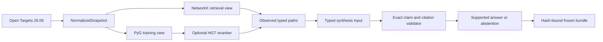

# Architecture

[README](../README.md) | [Evidence workbench](demo/) | [Data and safety](data-and-safety.md) |
[Kaggle runbook](../notebooks/KAGGLE_RUNBOOK_06-knetminer-llm.md)

The package is divided into contracts, data normalization, graph views and splits, retrieval, optional
HGT scoring, synthesis validation, evaluation helpers, and frozen-bundle rendering. Each boundary
accepts typed values and fails before passing malformed or unsupported state downstream.

`NormalizedSnapshot` is the shared source of truth. `build_graph_views()` derives both NetworkX and
PyTorch Geometric representations and reconciles their stable node and forward-edge identities.
Forward edges are citable; generated reverse twins are transport-only. The link-prediction split uses
only disease-target associations and retains reverse twins only for training edges.

Retrieval enumerates explicit typed relation sequences within fixed caps. Optional HGT scores may
reorder returned observed paths but cannot add candidates. Synthesis receives only the validated
intent, entity IDs, and evidence-path fields. The output gate permits one conservative supported claim
or a structured abstention.

The static surface loads a frozen bundle against a trusted expected snapshot hash. The bundle owns an
inventory of forward edge IDs and evidence paths, so answers cannot cite missing or reverse-only edges.
No network request, model load, graph build, or training operation occurs while rendering a bundle.

## Boundary Ownership

| Boundary | Owns | Must not do |
| --- | --- | --- |
| Normalization | Stable IDs, source provenance, canonical relations | Infer unsupported edges |
| Graph views | Consistent NetworkX/PyG identities | Make reverse transport edges citable |
| Split | Grouped train/validation/test membership | Leak held-out edges or reverse twins |
| Retrieval | Bounded observed typed paths | Treat rank as evidence creation |
| HGT | Scores for existing candidates | Add paths, edges, citations, or facts |
| Synthesis | One typed evidence payload | Receive raw user instructions as evidence |
| Validation | Exact claims, path IDs, citations, abstention | Display unvalidated model output |
| Bundle | Immutable sanitized display records and hashes | Load models, call APIs, or train |

## Failure Semantics

Malformed source records, graph-view disagreement, leakage, ambiguous resolution, missing paths,
prompt injection, invalid claims, citation mismatch, and bundle-hash mismatch all fail closed. A
requested CUDA route also fails if CUDA is unavailable; it does not silently continue on CPU.
